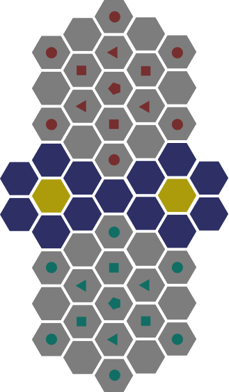
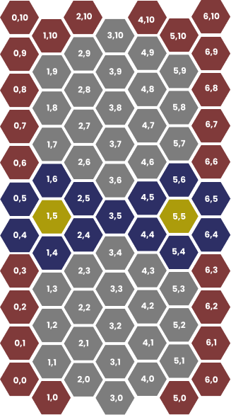
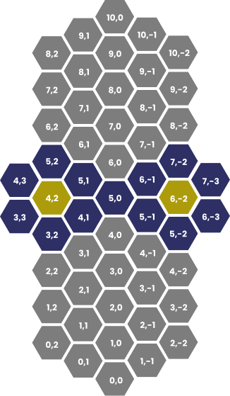
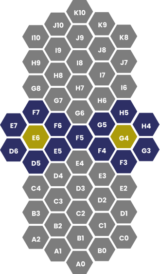

- **Project name:** Tactilog
- **TP class:** 3LEIC11
- **Group:** Tactigon_3
- **Group members:**
    - Ana Rita Varanda Cachaldora Pereira (up202108798@fe.up.pt)
    - Luís Miguel Mota Duarte (up202108734@fe.up.pt)

# Instalation and Execution

In order to play the game properly you must use a font that has the `Simbols for legacy computing` block. An example of a font that supports this UTF-8 block is Iosevka and you can download the ttf files [here](https://github.com/be5invis/Iosevka/releases/download/v27.3.4/ttf-iosevka-27.3.4.zip).  Tactilog only is tested for SICStus and therefore it probably won’t work with other Prolog runtimes.

Before running the game, you must check if you changed the font to a correct one you should consult the `src/main.pl` file and the execute the predicate `play/0`.

# The game

Tactilog is a text-based board game implemented in Prolog based on the strategy game Tactigon.

The board is a mosaic of hexagon tiles, where each side with grey tiles is assigned to a player’s pieces, the center with blue tiles is a no man’s land, and the two gold tiles are the victory tiles.

A player wins the game if they are occupying both the gold tiles after the oponent’s turn or by taking the oponent’s pentagon.

There are 4 different kinds of pieces in the game - the circle, the triangle, the square and the pentagon. Each piece can move up to the number of sides that it has, per turn (eg. a square can move up to 4 tiles in a turn).  They are displayed in the board as such:

When it comes to taking the oponents pieces, there are some rules to it. Depending on which kind of piece is taking another, the attacking piece might have to be removed from the board, or not be allowed to take the oponents piece at all. We can see that in the table below.

| Atacks\Defends | Circle | Triangle | Square | Pentagon |
| --- | --- | --- | --- | --- |
| Circle | Defendant is captured | Defendant is captured | Defendant is captured | Defendant is captured |
| Triangle | Both are captured | Defendant is captured | Defendant is captured | Defendant is captured |
| Square | Can’t attack | Both are captured | Defendant is captured | Defendant is captured |
| Pentagon | Can’t attack | Can’t attack | Can’t attack | Defendant is captured |

# Game logic

## Game state representation

There are three ways to represent the board internally - offset coordinates, axial coordinates and algebraic coordinates. It can seem odd to choose multiple coordinate systems, but in hexagon grids, each system has it’s own advantages and disadvantages, so we choose to convert between systems to have the “best” of multiple worlds, while sacrificing a negligible amount of performance.   

### Offset Coordinates

The offset coordinates are an array of arrays used to store the board state.

The representation of the pieces is related to the number of sides that it has. A red circle piece, for example, is represented as a 1 in the array of arrays. However, a blue circle piece is represented as a 6 (with an offset of 5), to distinguish it from a red circle piece.

### Axial Coordinates

The axial coordinates are inspired by the diagonal plane of a cube. A plane can be represented by the expression `q + r + s = 0` , and we store the q and r (we don’t need to store s because we can calculate it).

This coordinate system is used to calculate distances and make any sort of calculations related to positions.

### Algebraic Coordinates

The last coordinate system is the algebraic coordinate system. It is inspired by the chess coordinates (with a letter and a number) and it is used during the game by the player to identify which piece they want to move and where to.

## Game state visualization

As described before, the game uses specials characters (from the `Symbols for legacy computing`) in order to draw perfectly regular horizontal hexagons. This is done with the predicate `draw_board` and it takes advantage of `ANSI escape codes` in order to clear the screen, set custom colors and set a cursor position. You can also alter the shape, by altering the Board itself, but if you wish to expand the board beyond the Tactigon limits, you have to alter the max for Q and R in the `[hexagon.pl](http://hexagon.pl)` file.

We can divide the drawing process in these “simple” steps:

- Find the center coordinates of each hexagon (in a offset-coordinate system, you will notice that even rows are a character up than the odd rows).
- Set the hexagon around the center coordinate; This also includes checking if a hexagon has a neighbor and setting the connections accordingly.
- Print the piece and it’s color, if the hexagon contains a piece.

## Move validation and execution

Move validation consists of the following steps: First we check if the source coordinates contain a piece and if the piece is on our team. Then, we do the same process on the destination coordinates but the must not contain a piece or a enemy piece. We also check if the source piece can eat the destination piece (if it exists), by checking the attackers table, also defined in the `attack_list` predicate. Finally, we check if the source piece can reach the destination piece, by checking the hexagon distances between source and destination. 

Unfortunately, only calculating the distance doesn’t give us the right answer (since pieces cannot jump another pieces), but it can give us an optimization step (especially when AI calculates a move). While in a 2D square system, the distances to neighbors are not all the same (the diagonals have a distance of $sqrt(2)$ and lines have just 1). In a hexagon system they are the same, which implies that there could be many ways to a piece to get from a place to another. In order to solve this, we use a BFS (Breath First Search) with the maximum distance of the piece to see if the move is feasible or not.

If the move is feasible we have two states, described in the attack table above, only the defendant is captured or both pieces are captured.

This is handled mainly by the `move_piece` predicate, which calls `commit_piece` and `check_path_possible`.

## List of valid Moves

In order to obtain the list of valid moves in a determined board in a certain player’s turn, we can do  the Cartesian Product of all coordinates in the board. This will give us an exhaustive list of all possibilities a user or an AI can make. Then we can filter most of the plays, in a performant way, because they are either invalid automatically invalid, or then, they are considered infeasible due to other pieces blocking it (this check takes much more computational time).  

## End of Game

As said before, a player wins if they capture the other player’s pentagon or occupies both victory tiles at the end of the opponents turn.

This winning condition is checked through the predicate `check_win_condition` . There are four declarations of this, in order to check both players and both winning conditions. 

In case of the pentagon capture win, we use the negation of the predicate `find_pentagon` to check if the opponent’s pentagon hasn’t been captured. If it has, the predicate returns the player.

As for the other case, we use the auxiliary predicate `get_board_piece_axial` to check if the board piece on the specific coordinates of each victory tile are occupied by a piece belonging to the player. This is done by checking the value of the piece, which will have a value below or above 5 depending on the player we are checking.

## Game State Evaluation

In order to win a game of Tactigon, control of the middle of the board is essencial, since we have the golden squares that when controlled will win the game(that realistically, is where the game is decided, since the pentagon can escape easily). So in order to calculate the game evaluation, we take the number of pieces that control directly one of the two gold squares, we then compare it to the enemy number of pieces that also control and compare it. 

Our objective is to maximize the number pieces that control the squares (and therefore also to minimize the number of pieces that the enemy can use to control the golden squares). We also check if the next move considered will result on a win/loss and shift the evaluation accordingly (to 100 or -100 respectively).

## Computer Plays

In addition to the Player vs Player mode, we have two modes:

- A random move mode, that doesn’t consider at all the current game evaluation
- A greedy mode, that always plays the best move considered by the game state evaluation above.

# Conclusions

This project was very peculiar, comparing it to the previous projects we’ve done in other courses. This programming paradigm was very limiting, making us think outside the box. 

Some difficulties we had include the game interface, since it is a text-based game and there aren’t very good ways to represent hexagons through ascii characters.

There are some improvements that could be done, such as morphing the three coordinate systems into one to make the game logic simpler and developing a more intuitive way for the player to pick where the pieces should go.

Overall, it was an interesting project and removed us from our comfort zone.

# Bibliography

[SICStus Documentation](https://sicstus.sics.se/sicstus/docs/latest4/html/sicstus.html/)

[Red Blob Games - Hexagon Representation](https://www.redblobgames.com/grids/hexagons/)
